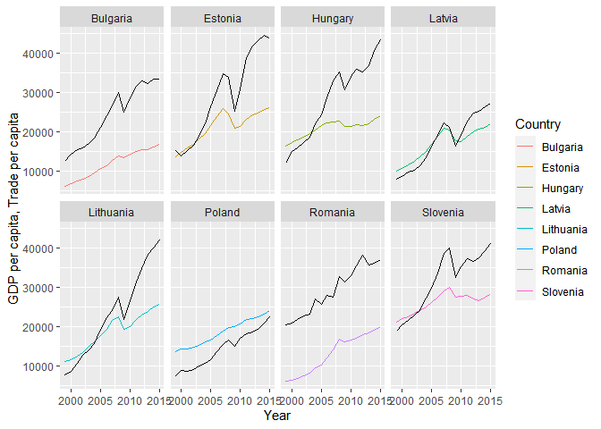
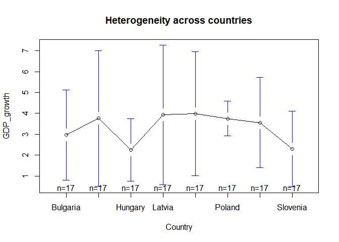
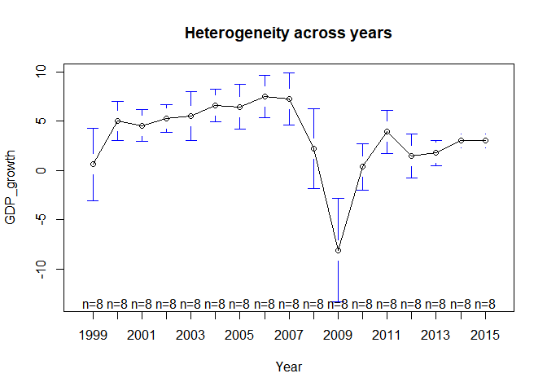
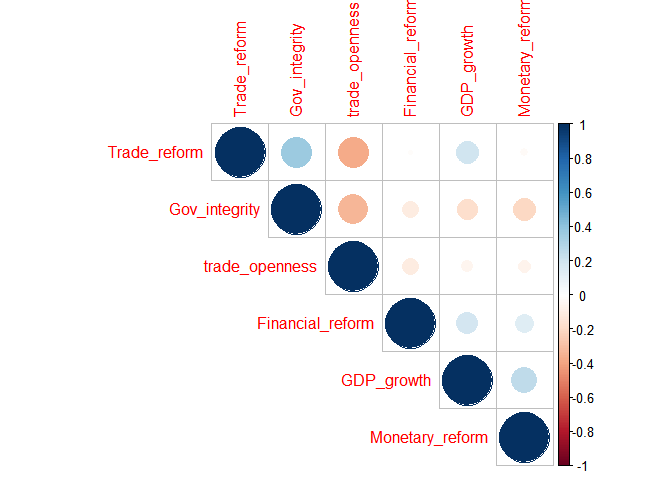

Institutions, Reforms and Economic Growth
================

## Data cleaning and preparation

This was quite the learning experience. I chose to only work with the
new EU member state data.

``` r
library(readxl)
library(tidyverse)
library(stringr)
library(dplyr)
library(plm)
library(modelr)
library(corrplot)
library(stargazer)
library(gplots)
library(sjPlot)

url1 <- "https://github.com/klimaviu/Institutions-and-Growth/raw/master/Reforms_database_Project_2020.xlsx"
destfile1 <- "Reforms_database_Project_2020.xlsx"
curl::curl_download(url1, destfile1)

Reforms <- read_excel(destfile1,
                      skip = 1,
                      col_types = c(rep("text",2), rep("numeric", 81)))[2:716,] %>% 
  rename(New_old = `New/old`)

Reforms <- Reforms %>% mutate(
  EU =  factor(EU, levels = c("0", "1")),
  gov_party = factor(gov_party, levels = c("1", "2", "3", "4", "5"))
)

url2 <- "https://github.com/klimaviu/Institutions-and-Growth/raw/master/heritage-economic-freedom.xlsx"
destfile2 <- "heritage_economic_freedom.xlsx"
curl::curl_download(url2, destfile2)

heritage <- read_excel(destfile2,
                       col_types = c("text", rep("numeric", 14))) %>% 
  filter(Name %in% c(Reforms$Country)) %>% 
  rename(Year = "Index Year",
         Country = "Name",
         Overall_score = "Overall Score",
         Property_rights = "Property Rights",
         Judicial_effectiveness = "Judicial Effectiveness",
         Gov_integrity = "Government Integrity",
         Tax_burden = "Tax Burden",
         Gov_spending = "Government Spending",
         Fiscal_health = "Fiscal Health",
         Business_freedom = "Business Freedom",
         Labor_freedom = "Labor Freedom",
         Monetary_freedom = "Monetary Freedom",
         Trade_freedom = "Trade Freedom",
         Investment_freedom = "Investment Freedom",
         Financial_freedom = "Financial Freedom")

non_EU_countries <- c("United States", "Norway", "Switzerland", "Iceland", "Canada", "Japan", "Australia", "New Zealand", "Korea")         

'%!in%' <- function(x,y)!('%in%'(x,y))

Updated <- full_join(Reforms, heritage, by = c("Year", "Country")) %>% 
  filter(Year >=1996, Year <=2015) %>% 
  filter(Country %!in% non_EU_countries) %>% 
  select(New_old, Country, Year, GDP, GDP_per_capita, GDP_growth,
         trade_openness, capital_openness, Overall_score, Property_rights,
         Gov_integrity, Tax_burden, Gov_spending, Business_freedom, Labor_freedom,
         Monetary_freedom, Trade_freedom, Investment_freedom, Financial_freedom,
         lmr_fraser, GG_debt, EU, gov_party, gov_type, gov_new) %>% 
  mutate(
    Monetary_reform = c(rep(NA,3),ifelse((diff(Monetary_freedom,3))>0,1,0)), #New variables for reforms
    Spending_reform = c(rep(NA,3),ifelse((diff(Gov_spending,3))>0,1,0)),
    Tax_reform = c(rep(NA,3),ifelse((diff(Tax_burden,3))<0,1,0)),
    Financial_reform = c(rep(NA,3),ifelse((diff(Financial_freedom,3))>0,1,0)),
    Trade_reform = c(rep(NA,3),ifelse((diff(trade_openness,3))>0,1,0)),
    Capital_reform = c(rep(NA,3),ifelse((diff(capital_openness,3))>0,1,0)),
    Investment_reform = c(rep(NA,3),ifelse((diff(Investment_freedom,3))>0,1,0)),
    Overall_reform = c(rep(NA,3),ifelse((diff(Overall_score,3))>0,1,0)),
    lMon_ref = lag(Monetary_reform, 1), #Lagged reforms for the compution of correlations
    lSp_ref = lag(Spending_reform, 1),
    lTax_ref = lag(Tax_reform,1),
    lFin_ref = lag(Financial_reform, 1),
    lTr_ref = lag(Trade_reform,1),
    lCap_ref = lag(Capital_reform, 1),
    Crisis = factor(ifelse(Year %in% c(2008, 2009), 1, 0)) #Banking crisis dummy
  ) %>% 
  filter(Year >=1999, Year <=2015)

NMS <- Updated %>% filter(New_old == "NMS")
```

## Figure 1: Trade per capita and GDP per capita

``` r
NMS %>% 
  mutate(
    population = GDP/GDP_per_capita,
    trade_per_capita = (trade_openness*GDP)/population
  ) %>% 
  ggplot()+
  geom_line(aes(Year, GDP_per_capita, color = Country))+
  geom_line(aes(Year, trade_per_capita))+
  facet_wrap(~Country, nrow = 2)+
  ylab("GDP per capita, Trade per capita")
```

<!-- -->

## Figure 2: Heterogeneity accross countries

``` r
plotmeans(GDP_growth ~ Country, main = "Heterogeneity across countries", data = NMS)
```

<!-- -->

## Figure 3: Heterogeneity accross years

``` r
plotmeans(GDP_growth ~ Year, main = "Heterogeneity across years", data = NMS)
```

<!-- -->

## Figure 4: A correlations graph

``` r
NMS_cor6 <- NMS %>%
  select(GDP_growth, Monetary_reform,Financial_reform, 
         Trade_reform, Gov_integrity, trade_openness)

corrplot(cor(NMS_cor6), type = "upper", order = "hclust")
```

<!-- -->

``` r
final_correlations <- cor(NMS_cor6)
```

# *Fixed effects regressions*

## Looking at trade openness

``` r
fixed <- plm(GDP_growth ~ trade_openness + Crisis,
             data=NMS,
             index=c("Country", "Year"),
             model = "within")
summary(fixed, se = vcovHC(fixed))
```

    ## Oneway (individual) effect Within Model
    ## 
    ## Call:
    ## plm(formula = GDP_growth ~ trade_openness + Crisis, data = NMS, 
    ##     model = "within", index = c("Country", "Year"))
    ## 
    ## Balanced Panel: n = 8, T = 17, N = 136
    ## 
    ## Residuals:
    ##       Min.    1st Qu.     Median    3rd Qu.       Max. 
    ## -12.548065  -1.999439   0.069099   1.995110  11.318112 
    ## 
    ## Coefficients:
    ##                Estimate Std. Error t-value  Pr(>|t|)    
    ## trade_openness  -1.6560     1.2259 -1.3509    0.1792    
    ## Crisis1         -7.1623     1.0750 -6.6629 7.507e-10 ***
    ## ---
    ## Signif. codes:  0 '***' 0.001 '**' 0.01 '*' 0.05 '.' 0.1 ' ' 1
    ## 
    ## Total Sum of Squares:    2791.7
    ## Residual Sum of Squares: 2051.2
    ## R-Squared:      0.26526
    ## Adj. R-Squared: 0.21278
    ## F-statistic: 22.745 on 2 and 126 DF, p-value: 3.6838e-09

``` r
fixed2 <- plm(GDP_growth ~ trade_openness + factor(gov_party) + Gov_integrity + Crisis,
             data=NMS,
             index=c("Country", "Year"),
             model = "within")
summary(fixed2, se = vcovHC(fixed2))
```

    ## Oneway (individual) effect Within Model
    ## 
    ## Call:
    ## plm(formula = GDP_growth ~ trade_openness + factor(gov_party) + 
    ##     Gov_integrity + Crisis, data = NMS, model = "within", index = c("Country", 
    ##     "Year"))
    ## 
    ## Balanced Panel: n = 8, T = 17, N = 136
    ## 
    ## Residuals:
    ##       Min.    1st Qu.     Median    3rd Qu.       Max. 
    ## -12.964443  -1.761296  -0.017881   1.983556  11.142216 
    ## 
    ## Coefficients:
    ##                     Estimate Std. Error t-value  Pr(>|t|)    
    ## trade_openness     -0.708260   1.260304 -0.5620   0.57517    
    ## factor(gov_party)2  2.333541   1.054973  2.2119   0.02885 *  
    ## factor(gov_party)3  2.121515   1.283791  1.6525   0.10102    
    ## factor(gov_party)4  3.612217   1.475270  2.4485   0.01578 *  
    ## factor(gov_party)5  1.064799   2.013399  0.5289   0.59787    
    ## Gov_integrity      -0.188730   0.066357 -2.8442   0.00523 ** 
    ## Crisis1            -7.020415   1.068819 -6.5684 1.342e-09 ***
    ## ---
    ## Signif. codes:  0 '***' 0.001 '**' 0.01 '*' 0.05 '.' 0.1 ' ' 1
    ## 
    ## Total Sum of Squares:    2791.7
    ## Residual Sum of Squares: 1842
    ## R-Squared:      0.34017
    ## Adj. R-Squared: 0.26382
    ## F-statistic: 8.91147 on 7 and 121 DF, p-value: 8e-09

## Looking at reforms:

``` r
fixed_reform <- plm(GDP_growth ~ Trade_reform + Crisis,
                    data=NMS,
                    index=c("Country", "Year"), 
                    model = "within")
summary(fixed_reform, se = vcovHC(fixed_reform))
```

    ## Oneway (individual) effect Within Model
    ## 
    ## Call:
    ## plm(formula = GDP_growth ~ Trade_reform + Crisis, data = NMS, 
    ##     model = "within", index = c("Country", "Year"))
    ## 
    ## Balanced Panel: n = 8, T = 17, N = 136
    ## 
    ## Residuals:
    ##      Min.   1st Qu.    Median   3rd Qu.      Max. 
    ## -11.26816  -2.24033   0.20394   2.27549  11.94777 
    ## 
    ## Coefficients:
    ##              Estimate Std. Error t-value  Pr(>|t|)    
    ## Trade_reform  2.04931    0.91436  2.2413   0.02676 *  
    ## Crisis1      -6.61761    1.08188 -6.1168 1.112e-08 ***
    ## ---
    ## Signif. codes:  0 '***' 0.001 '**' 0.01 '*' 0.05 '.' 0.1 ' ' 1
    ## 
    ## Total Sum of Squares:    2791.7
    ## Residual Sum of Squares: 2001.1
    ## R-Squared:      0.2832
    ## Adj. R-Squared: 0.232
    ## F-statistic: 24.8904 on 2 and 126 DF, p-value: 7.7648e-10

## Introducing more reform variables

``` r
fixed_reform2 <- plm(GDP_growth ~ Trade_reform + Financial_reform + Monetary_reform + Crisis,
                     data=NMS,
                     index=c("Country", "Year"), 
                     model = "within")
summary(fixed_reform2, se = vcovHC(fixed_reform2))
```

    ## Oneway (individual) effect Within Model
    ## 
    ## Call:
    ## plm(formula = GDP_growth ~ Trade_reform + Financial_reform + 
    ##     Monetary_reform + Crisis, data = NMS, model = "within", index = c("Country", 
    ##     "Year"))
    ## 
    ## Balanced Panel: n = 8, T = 17, N = 136
    ## 
    ## Residuals:
    ##      Min.   1st Qu.    Median   3rd Qu.      Max. 
    ## -10.97769  -1.84747   0.29365   2.14878  11.14137 
    ## 
    ## Coefficients:
    ##                  Estimate Std. Error t-value  Pr(>|t|)    
    ## Trade_reform      2.19031    0.90632  2.4167   0.01712 *  
    ## Financial_reform  0.91468    0.98096  0.9324   0.35292    
    ## Monetary_reform   1.47679    0.79003  1.8693   0.06394 .  
    ## Crisis1          -5.78791    1.13372 -5.1053 1.209e-06 ***
    ## ---
    ## Signif. codes:  0 '***' 0.001 '**' 0.01 '*' 0.05 '.' 0.1 ' ' 1
    ## 
    ## Total Sum of Squares:    2791.7
    ## Residual Sum of Squares: 1925.3
    ## R-Squared:      0.31035
    ## Adj. R-Squared: 0.24918
    ## F-statistic: 13.9507 on 4 and 124 DF, p-value: 2.0001e-09

## Introducing gov\_type and Gov\_integirty as a control variable

``` r
fixed_reform3 <- plm(GDP_growth ~ Trade_reform + Financial_reform + Monetary_reform + Crisis + factor(gov_party) + Gov_integrity,
                     data=NMS,
                     index=c("Country", "Year"), 
                     model = "within")
summary(fixed_reform3, se = vcovHC(fixed_reform3))
```

    ## Oneway (individual) effect Within Model
    ## 
    ## Call:
    ## plm(formula = GDP_growth ~ Trade_reform + Financial_reform + 
    ##     Monetary_reform + Crisis + factor(gov_party) + Gov_integrity, 
    ##     data = NMS, model = "within", index = c("Country", "Year"))
    ## 
    ## Balanced Panel: n = 8, T = 17, N = 136
    ## 
    ## Residuals:
    ##      Min.   1st Qu.    Median   3rd Qu.      Max. 
    ## -11.46535  -1.87137   0.37832   1.71700  10.56990 
    ## 
    ## Coefficients:
    ##                     Estimate Std. Error t-value Pr(>|t|)    
    ## Trade_reform        2.811971   0.905012  3.1071 0.002363 ** 
    ## Financial_reform    0.734481   0.952573  0.7710 0.442206    
    ## Monetary_reform     0.580041   0.790833  0.7335 0.464723    
    ## Crisis1            -5.941203   1.109463 -5.3550 4.23e-07 ***
    ## factor(gov_party)2  2.434636   1.030697  2.3621 0.019794 *  
    ## factor(gov_party)3  1.421597   1.261356  1.1270 0.261994    
    ## factor(gov_party)4  3.243886   1.445631  2.2439 0.026687 *  
    ## factor(gov_party)5  0.640630   1.945666  0.3293 0.742538    
    ## Gov_integrity      -0.212452   0.065666 -3.2353 0.001573 ** 
    ## ---
    ## Signif. codes:  0 '***' 0.001 '**' 0.01 '*' 0.05 '.' 0.1 ' ' 1
    ## 
    ## Total Sum of Squares:    2791.7
    ## Residual Sum of Squares: 1693.4
    ## R-Squared:      0.39342
    ## Adj. R-Squared: 0.31186
    ## F-statistic: 8.57582 on 9 and 119 DF, p-value: 8.0277e-10

## Lagging reforms:

``` r
fixed_reform4 <- plm(GDP_growth ~ lag(Trade_reform) + lag(Financial_reform) + lag(Monetary_reform) + Crisis + factor(gov_party) + Gov_integrity,
                     data=NMS,
                     index=c("Country", "Year"), 
                     model = "within")
summary(fixed_reform4, se = vcovHC(fixed_reform4))
```

    ## Oneway (individual) effect Within Model
    ## 
    ## Call:
    ## plm(formula = GDP_growth ~ lag(Trade_reform) + lag(Financial_reform) + 
    ##     lag(Monetary_reform) + Crisis + factor(gov_party) + Gov_integrity, 
    ##     data = NMS, model = "within", index = c("Country", "Year"))
    ## 
    ## Balanced Panel: n = 8, T = 16, N = 128
    ## 
    ## Residuals:
    ##      Min.   1st Qu.    Median   3rd Qu.      Max. 
    ## -12.48922  -1.60760   0.23631   1.59170   9.46742 
    ## 
    ## Coefficients:
    ##                       Estimate Std. Error t-value  Pr(>|t|)    
    ## lag(Trade_reform)      1.28146    0.91701  1.3974  0.165069    
    ## lag(Financial_reform)  1.73799    0.92214  1.8847  0.062080 .  
    ## lag(Monetary_reform)   0.45234    0.79636  0.5680  0.571172    
    ## Crisis1               -6.98425    1.01762 -6.8633 4.042e-10 ***
    ## factor(gov_party)2     1.69964    1.04966  1.6192  0.108237    
    ## factor(gov_party)3     1.06742    1.36507  0.7820  0.435909    
    ## factor(gov_party)4     2.48647    1.49535  1.6628  0.099174 .  
    ## factor(gov_party)5    -0.19422    1.91097 -0.1016  0.919229    
    ## Gov_integrity         -0.24047    0.07160 -3.3585  0.001074 ** 
    ## ---
    ## Signif. codes:  0 '***' 0.001 '**' 0.01 '*' 0.05 '.' 0.1 ' ' 1
    ## 
    ## Total Sum of Squares:    2574.3
    ## Residual Sum of Squares: 1463.8
    ## R-Squared:      0.43139
    ## Adj. R-Squared: 0.34943
    ## F-statistic: 9.35713 on 9 and 111 DF, p-value: 1.7771e-10

## Lagging one reform variable:

``` r
fixed_reform5 <- plm(GDP_growth ~ Trade_reform + lag(Financial_reform) + Monetary_reform + Crisis + factor(gov_party) + Gov_integrity,
                     data=NMS,
                     index=c("Country", "Year"), 
                     model = "within")
summary(fixed_reform5, se = vcovHC(fixed_reform5))
```

    ## Oneway (individual) effect Within Model
    ## 
    ## Call:
    ## plm(formula = GDP_growth ~ Trade_reform + lag(Financial_reform) + 
    ##     Monetary_reform + Crisis + factor(gov_party) + Gov_integrity, 
    ##     data = NMS, model = "within", index = c("Country", "Year"))
    ## 
    ## Balanced Panel: n = 8, T = 16, N = 128
    ## 
    ## Residuals:
    ##       Min.    1st Qu.     Median    3rd Qu.       Max. 
    ## -11.682603  -1.587671  -0.051404   1.594819   8.899523 
    ## 
    ## Coefficients:
    ##                        Estimate Std. Error t-value  Pr(>|t|)    
    ## Trade_reform           2.000800   0.893123  2.2402 0.0270675 *  
    ## lag(Financial_reform)  1.781938   0.905269  1.9684 0.0515145 .  
    ## Monetary_reform        0.388005   0.784825  0.4944 0.6220121    
    ## Crisis1               -6.206483   1.055252 -5.8815 4.366e-08 ***
    ## factor(gov_party)2     2.043988   1.032874  1.9789 0.0503001 .  
    ## factor(gov_party)3     1.394095   1.285896  1.0841 0.2806504    
    ## factor(gov_party)4     2.867388   1.429142  2.0064 0.0472483 *  
    ## factor(gov_party)5     0.185327   1.887032  0.0982 0.9219421    
    ## Gov_integrity         -0.243984   0.067666 -3.6057 0.0004679 ***
    ## ---
    ## Signif. codes:  0 '***' 0.001 '**' 0.01 '*' 0.05 '.' 0.1 ' ' 1
    ## 
    ## Total Sum of Squares:    2574.3
    ## Residual Sum of Squares: 1427.9
    ## R-Squared:      0.44533
    ## Adj. R-Squared: 0.36538
    ## F-statistic: 9.90212 on 9 and 111 DF, p-value: 4.9876e-11

## Generating heteroskedasticity robust SEs and the table

``` r
rob_se1 <- list(sqrt(diag(vcovHC(fixed))),
               sqrt(diag(vcovHC(fixed_reform))),
               sqrt(diag(vcovHC(fixed_reform2))))

rob_se2 <- list(sqrt(diag(vcovHC(fixed_reform3))),
               sqrt(diag(vcovHC(fixed_reform4))),
               sqrt(diag(vcovHC(fixed_reform5))))

table1 <- stargazer(fixed, fixed_reform, fixed_reform2, 
                   digits = 3,
                   header = FALSE,
                   type = "text", 
                   se = rob_se1,
                   title = "Linear Panel Regression Models of the Impact of Institutions and Reforms on Economic Growth",
                   model.numbers = FALSE,
                   column.labels = c("(1)", "(2)", "(3)"))
```

    ## 
    ## Linear Panel Regression Models of the Impact of Institutions and Reforms on Economic Growth
    ## ========================================================================================
    ##                                            Dependent variable:                          
    ##                  -----------------------------------------------------------------------
    ##                                                GDP_growth                               
    ##                            (1)                     (2)                     (3)          
    ## ----------------------------------------------------------------------------------------
    ## trade_openness          -1.656***                                                       
    ##                          (0.618)                                                        
    ##                                                                                         
    ## Trade_reform                                     2.049*                  2.190*         
    ##                                                  (1.224)                 (1.202)        
    ##                                                                                         
    ## Financial_reform                                                          0.915         
    ##                                                                          (0.985)        
    ##                                                                                         
    ## Monetary_reform                                                         1.477***        
    ##                                                                          (0.219)        
    ##                                                                                         
    ## Crisis1                 -7.162***               -6.618***               -5.788***       
    ##                          (1.997)                 (1.910)                 (1.888)        
    ##                                                                                         
    ## ----------------------------------------------------------------------------------------
    ## Observations               136                     136                     136          
    ## R2                        0.265                   0.283                   0.310         
    ## Adjusted R2               0.213                   0.232                   0.249         
    ## F Statistic      22.745*** (df = 2; 126) 24.890*** (df = 2; 126) 13.951*** (df = 4; 124)
    ## ========================================================================================
    ## Note:                                                        *p<0.1; **p<0.05; ***p<0.01

``` r
table2 <- stargazer(fixed_reform3, fixed_reform4, fixed_reform5, 
                    digits = 3,
                    header = FALSE,
                    type = "text", 
                    se = rob_se2,
                    title = "Linear Panel Regression Models of the Impact of Institutions and Reforms on Economic Growth",
                    model.numbers = FALSE,
                    column.labels = c( "(4)", "(5)", "(6)"))
```

    ## 
    ## Linear Panel Regression Models of the Impact of Institutions and Reforms on Economic Growth
    ## ==========================================================================================
    ##                                               Dependent variable:                         
    ##                       --------------------------------------------------------------------
    ##                                                    GDP_growth                             
    ##                                (4)                    (5)                    (6)          
    ## ------------------------------------------------------------------------------------------
    ## Trade_reform                 2.812***                                       2.001*        
    ##                              (1.054)                                       (1.078)        
    ##                                                                                           
    ## Financial_reform              0.734                                                       
    ##                              (0.629)                                                      
    ##                                                                                           
    ## Monetary_reform               0.580                                         0.388         
    ##                              (0.437)                                       (0.405)        
    ##                                                                                           
    ## lag(Trade_reform)                                    1.281                                
    ##                                                     (0.853)                               
    ##                                                                                           
    ## lag(Financial_reform)                               1.738**                1.782***       
    ##                                                     (0.771)                (0.612)        
    ##                                                                                           
    ## lag(Monetary_reform)                                 0.452                                
    ##                                                     (0.586)                               
    ##                                                                                           
    ## Crisis1                     -5.941***              -6.984***              -6.206***       
    ##                              (1.720)                (1.913)                (1.656)        
    ##                                                                                           
    ## factor(gov_party)2           2.435**                 1.700                 2.044**        
    ##                              (1.169)                (1.186)                (0.998)        
    ##                                                                                           
    ## factor(gov_party)3            1.422                  1.067                  1.394         
    ##                              (1.627)                (1.588)                (1.348)        
    ##                                                                                           
    ## factor(gov_party)4           3.244**                 2.486                 2.867**        
    ##                              (1.484)                (1.523)                (1.413)        
    ##                                                                                           
    ## factor(gov_party)5            0.641                  -0.194                 0.185         
    ##                              (1.887)                (1.747)                (1.625)        
    ##                                                                                           
    ## Gov_integrity               -0.212***              -0.240***              -0.244***       
    ##                              (0.071)                (0.061)                (0.052)        
    ##                                                                                           
    ## ------------------------------------------------------------------------------------------
    ## Observations                   136                    128                    128          
    ## R2                            0.393                  0.431                  0.445         
    ## Adjusted R2                   0.312                  0.349                  0.365         
    ## F Statistic           8.576*** (df = 9; 119) 9.357*** (df = 9; 111) 9.902*** (df = 9; 111)
    ## ==========================================================================================
    ## Note:                                                          *p<0.1; **p<0.05; ***p<0.01
